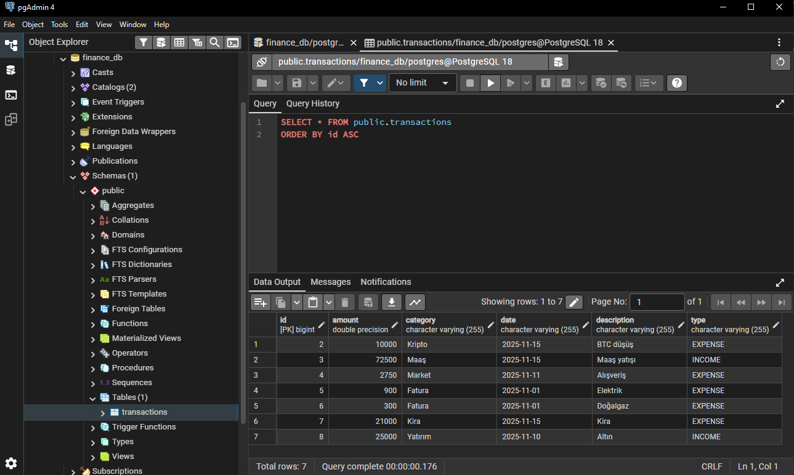
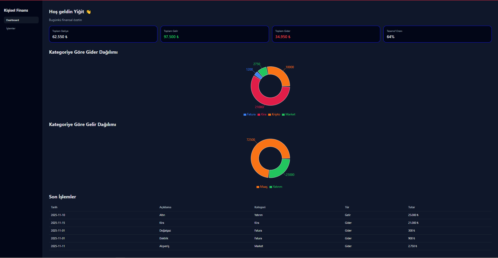
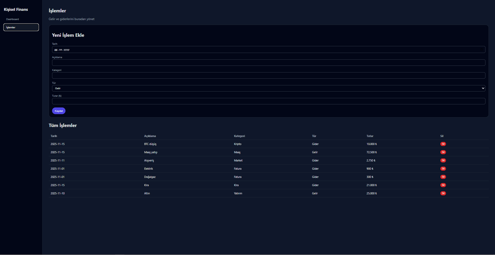

# Personal Finance Management Platform 💰

A full–stack personal finance dashboard where users can track their incomes and expenses, analyze their spending, and visualize data with interactive charts.

- Backend: **Spring Boot + PostgreSQL**
- Frontend: **React + Vite + Recharts**
- Architecture: **RESTful API + SPA (Single Page Application)**

---

# 📊 Preview

<p align="center">
  
  
  

</p>

---

## ✨ Features

- Add, list and delete **income** and **expense** transactions
- Summary cards on the dashboard:
  - Total balance
  - Total income
  - Total expense
  - Savings rate (%)
- Visual analytics:
  - **Expense distribution by category** (pie chart)
  - **Income distribution by category** (pie chart)
- Persistent storage with **PostgreSQL**  
  (data is not lost when the application restarts)
- Clean separation of concerns:
  - Spring Boot REST API
  - React single–page dashboard

---

## 🧰 Tech Stack

**Backend**
- Java 17
- Spring Boot (Web, Data JPA)
- PostgreSQL
- Maven

**Frontend**
- React
- Vite
- Recharts (charts)
- Fetch API

**Tooling**
- Git / GitHub
- pgAdmin (PostgreSQL management)
- IntelliJ IDEA / VS Code

---

## 🗂 Project Structure

```text
finance-app/
 ├── finance-backend/        # Spring Boot REST API + PostgreSQL integration
 ├── frontend/               # React + Vite dashboard
 └── start-dev.bat           # Windows script to start backend & frontend together

```
---
# 🚀 Getting Started

This project includes an automatic startup script (**start-dev.bat**) that launches both the backend and frontend in separate terminals with a single command.

## ✅ Requirements
- JDK 17+
- Node.js + npm
- PostgreSQL
- Git

## 📦 Setup

```bash
# Clone the repository
git clone https://github.com/yigitkagankartal/Personal-Finance-Management-Platform.git

```

## 🗄 PostgreSQL Setup
Create a database named: `finance_db`

Open file:
finance-backend/src/main/resources/application.properties

Set your credentials:
spring.datasource.url=jdbc:postgresql://localhost:5432/finance_db
spring.datasource.username=postgres
spring.datasource.password=YOUR_PASSWORD
spring.jpa.hibernate.ddl-auto=update
spring.jpa.show-sql=true
spring.jpa.properties.hibernate.dialect=org.hibernate.dialect.PostgreSQLDialect

---

# ⚡ One-Click Startup (Recommended)

Use the auto-starter script:
./start-dev.bat

This script:
1) Starts backend → mvn spring-boot:run  
2) Waits 3 seconds  
3) Starts frontend → npm run dev

Application URLs:
🌐 Frontend → http://localhost:5173  
🔌 Backend API → http://localhost:8080/api/transactions

---

# 🔧 Manual Start (Alternative)

## Backend (Spring Boot)
cd finance-backend  
mvn clean package  
mvn spring-boot:run

## Frontend (React + Vite)
cd frontend  
npm install  
npm run dev

---

# 🔗 REST API Endpoints

GET /transactions  
POST /transactions  
DELETE /transactions/{id}

Example POST:
{
  "date": "2025-11-15",
  "description": "Market",
  "category": "Food",
  "type": "EXPENSE",
  "amount": 250
}

# 🚀 Future Enhancements
- 🔐 JWT Authentication  
- 📈 Monthly Trends (Line Charts)  
- 🌓 Dark Mode  
- 🐳 Docker + docker-compose (backend + frontend + PostgreSQL)  
- 💼 Multi-wallet / multi-account system  
- 📤 Export to CSV/Excel  

---


# 👤  [Dev](https://github.com/yigitkagankartal) 

